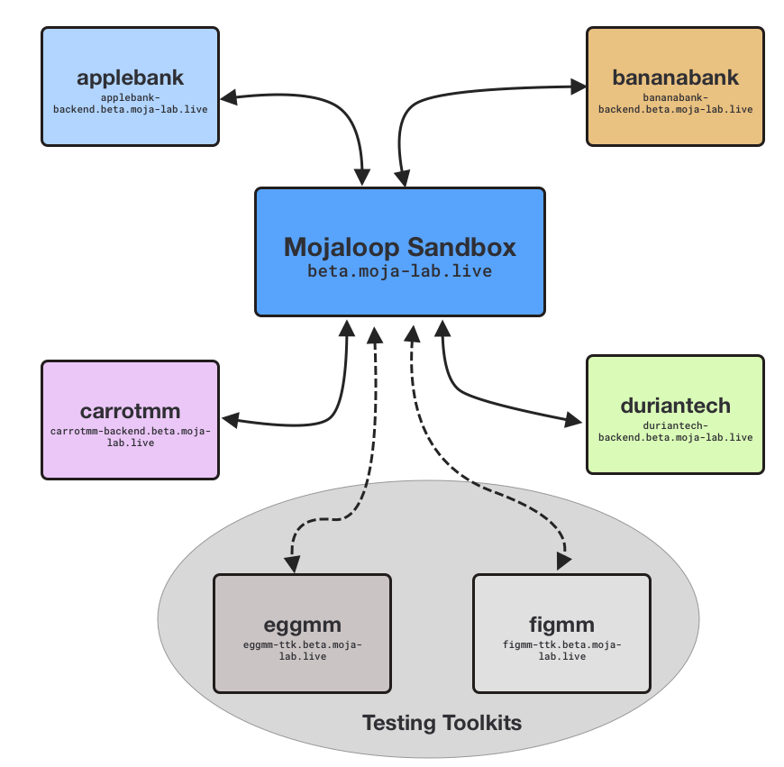

# Overview

This Mojaloop Sandbox is an open environment for playing around with Mojaloop.

All services use the base url `http://beta.moja-lab.live`

## What's included in The Environment?

Out of the box, this environment includes the following simulated DFSPs:

**DFSPs**
- `applebank` 
- `bananabank`
- `carrotmm`
- `duriantech`
- `eggmm` *(Testing Toolkit only)*
- `figmm` *(Testing Toolkit only)*

> **Note**:
> You can browse the list available DFSPs with this api call:
> [`http://beta.moja-lab.live/api/admin/central-ledger/participants`](http://beta.moja-lab.live/api/admin/central-ledger/participants)

**Users**  
And the current users are registered and available for lookup in the Account Lookup Service

| dfspId | Id Type | Id Value | Display Name |
| --- | --- | --- | --- |
| `applebank`  | `MSISDN` | `123456789`   | Alice Alpaca |
| `applebank`  | `MSISDN` | `11194979`    | Alex Alligator |
| `bananabank` | `MSISDN` | `218493479`   | Bob Bobbish |
| `bananabank` | `MSISDN` | `292455793`   | Belinda Bells |
| `carrotmm`   | `MSISDN` | `32929423`    | Cathy C |
| `carrotmm`   | `MSISDN` | `32929124`    | Colin Creevey |
| `duriantech` | `MSISDN` | `410283497`   | Dobby Elf    |
| `duriantech` | `MSISDN` | `4448483173`  | Draco Dragon |

You can play around with the existing DFSPs by using the [Simulator UI](http://simulator-ui.beta.moja-lab.live). Check out the [Simulator Guide](/3-guides/3_simulators/) for details on how to use the simulator UI.

## APIs

Mojaloop has a variety of APIs you can interact with:

| Name | Version | Who | Base URL |
| --- | --- | --- | --- |
| [FSPIOP (Mojaloop API)](/2-apis/fspiop)     | `v1.1` | DFSPs             | `beta.moja-lab.live/api/fspiop` |
| [Admin](2-apis/admin)                       | `v1`   | Hub Admins, DFSPs | `beta.moja-lab.live/api/admin/central-ledger` |
| [Settlement](2-apis/settlement.html)        | `v1`   | DFSPs             | (not currently available with this lab) |
| [Thirdparty-DFSP](/2-apis/thirdparty-dfsp)  | `v0.1` | DFSPs             | (Coming Soon) |
| [Thirdparty-PISP](/2-apis/thirdparty-pisp)  | `v0.1` | PISPs             | (Coming Soon) | 

## Use Cases 

The following Use Cases are supported in this lab:

|    | Name | Description | Status | Links |
|--- | ---- | ---- | ---- | ---- |
| 🟢 | P2P  | Peer To Peer transaction, from one party to another | Available | [P2P Transfer (Easy)](/3-guides/5_ttk_p2p.html) |
| 🟡 | PISP P2P | Peer To Peer transaction, initiated from 3rd party | Available (Locally) | [Thirdparty PISP API Local](/3-guides/6_pisp_local.html) |
| 🔴 | SEPA  | Cross Network, Outside Mojaloop into Mojaloop - Will be added with MIFOS Payment Hub | Coming Soon | _link coming soon!_|
| 🔴 | OTT Thirdparty (UK Open Banking Model) | P2P, PISP PSD2 approach - will be added with MIFOS Payment Hub | Coming Soon | _link coming soon!_|
| 🔴 | Refund | DFSP Initiated Refund Scenario - included with MIFOS Payment Hub | Coming Soon | _link coming soon!_|

### Roadmap

_The following is our roadmap for adding more use cases to the Mojaloop OSS Lab:_

- Request to Pay 
- Merchant Payment Scenarios
  - dynamic QR codes
  - static QR codes
- Bulk Transfers (G2P)
- Cross Currency
- Cross Network
- AISP OTT 
- Bill Payments
- GSMA MM API
- ATM
- Reconciliation - failed transactions
- Fraud Monitoring + Detection
- Settlement (Hub Operator)
- Liquidity management (Hub Operator)

## Tools:

This sandbox includes the following tools:

- [Sandbox Dev Hub](http://beta.moja-lab.live/home/0-getting-started)
- [Mojaloop Testing Toolkits](#testing-toolkit)
- [Simulator UI](http://simulator-ui.beta.moja-lab.live) - for more information on using the simulator-ui, refer to [todo this external guide]()

### Testing Toolkit

The [Mojaloop Testing Toolkit](https://github.com/mojaloop/ml-testing-toolkit) is a tool for testing your DFSP's implementation. It also helps you get up and running and 

We currently have 2 DFSPs hooked up to the testing toolkit: `figmm` and `eggmm`

See:
- [figmm - monitoring](http://figmm-ttk.beta.moja-lab.live/admin/monitoring) to monitor live requests and callbacks
- [figmm - send requests](http://figmm-ttk.beta.moja-lab.live/admin/outbound_request) to make live requests _from_ `figmm` to other DFSPs on the network
- [eggmm - monitoring](http://eggmm-ttk.beta.moja-lab.live/admin/monitoring) to monitor live requests and callbacks
- [eggmm - send requests](http://eggmm-ttk.beta.moja-lab.live/admin/outbound_request) to make live requests _from_ `eggmm` to other DFSPs on the network
  > Hint: Click "Load Sample" to look through the sample test cases available and load one

Check out the [Testing Toolkit P2P Guide](/3-guides/5_ttk_p2p/) to use the testing to send a peer to peer transfer.

### MIFOS Payment Hub

This lab is soon to be connected with the MIFOS Payment Hub, which will demonstrate the MIFOS and Mojaloop ecosystems working together, and let you test out a whole bunch of DFSP-based features.

**Check back soon for more information about the Mojaloop OSS Lab + MIFOS Payment Hub**

<!-- ### Payment Manager

> Note: Payment Manager support in the sandbox is still in _beta_, and the dfsps here are not yet connected to the other DFSPs in the sandbox. We're working on it!

- [Payment Manager- senderfsp](http://senderfsp-pm4ml.pm4ml.demo.modusbox.io/transfers) -->

<!-- ### Finance Portal

*Coming Soon!* -->

## Helpful Links

- [Mojaloop Documentation](https://docs.mojaloop.io/documentation/)
- [Mojaloop API Definition v1.0](https://docs.mojaloop.io/mojaloop-specification/documents/API%20Definition%20v1.0.html)
- [Mojaloop API OpenAPI (Swagger) Definitions](https://github.com/mojaloop/mojaloop-specification/blob/master/fspiop-api/documents/v1.1-document-set/)

