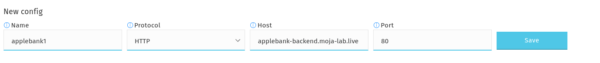
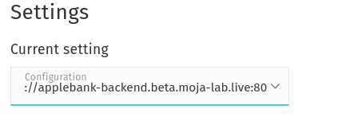
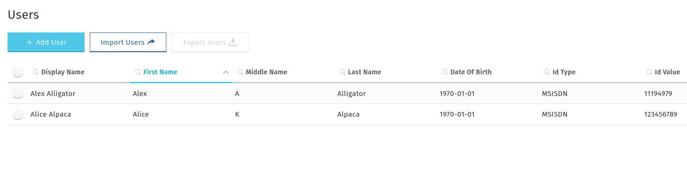
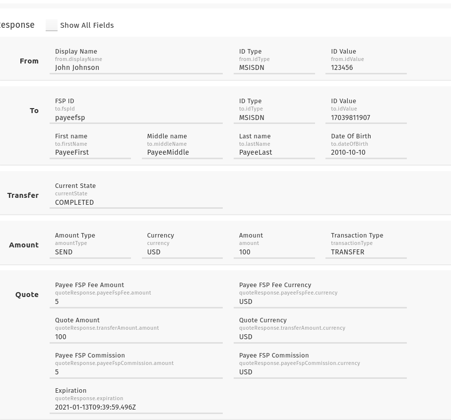
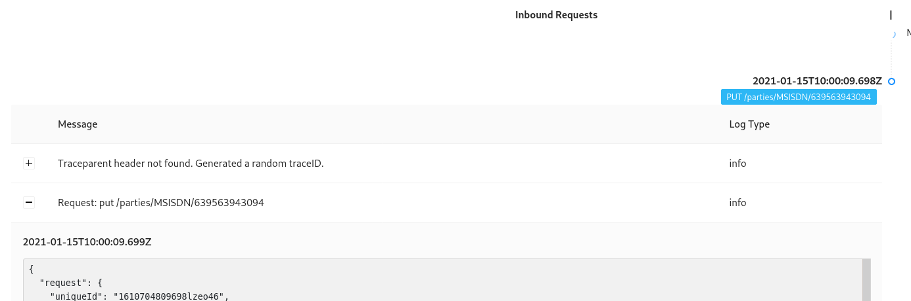

# Simulators

Refer to [mojaloop-simulator](https://github.com/mojaloop/mojaloop-simulator) on GitHub for more information on how the simulators.


This sandbox deploys simulators which allow you to:
1. Browse users registered with a DFSP
2. Send from one Party to another in a simple interface
## 1. Set up the Simulator UI(s)

1. Navigate to the Simulator UI page at [simulator-ui.beta.moja-lab.live](http://simulator-ui.beta.moja-lab.live)
2. Select "Settings" in the left bar

## 2. Register a DFSP Backend and check the users list

The Simulator UI page talks to a DFSP Simulator Backend behind the scenes. 

Before we go any further, we need to tell the simulator UI to connect to a specific Simulator Backend



For example, you can register the Applebank Simulator Backend

- name: `applebank1`
- protocol: `http`
- host: `applebank-backend.beta.moja-lab.live`
- port: `80`

And hit "Save"

Once you've created that config, make sure to select it in the "Current Setting" in the dropdown



Now you can navigate back to the list of users, and reload your browser. You should see a user list similar to the following:



## 3. Send a Transfer

1. Select "Outbound Send" on the left menu.

2. Leave the editor in "Simple Mode"


3. Leave all the fields the same except for the last, and change this to be a MSISDN you can find in [the users list here](/1-overview/#what-s-included-in-environment). For this example, let's enter `32929423`.

4. Select "Send Transfer"

## 4. Transfer Response

Behind the scenes, the DFSP Simulator uses the sdk-scheme-adapter to talk the Async Mojaloop API, and combines the separate Mojaloop Transfer steps (Discovery, Agreement, Transfer) into 1 step. This is a convenience for the Simulator environment, but can be configured depending on your DFSP's requirements (e.g. confirming Payee information with your user).

Here's a screenshot of an example response from the Simulator Backend:




## Handy Snippets:
### Listing all of the users for a given simulator:

```bash
curl http://<dfspid>-backend.beta.moja-lab.live/repository/parties | jq
```

Example result:
```bash
curl http://payeefsp-backend.beta.moja-lab.live/repository/parties | jq
[
  {
    "displayName": "Alice Alpaca",
    "firstName": "Alice",
    "middleName": "K",
    "lastName": "Alpaca",
    "dateOfBirth": "1970-01-01",
    "idType": "MSISDN",
    "idValue": "123456789"
  }
]

```


<!-- ## Simplified P2P Transfer

todo -->


### Register your own Party with Mojaloop + Simulator

First, tell Mojaloop which DFSP they should ask for this Party with `POST /participants`
```bash
curl -X POST http://beta.moja-lab.live/api/fspiop/participants/MSISDN/639563943094 \
  -H "Accept: application/vnd.interoperability.participants+json;version=1" \
  -H "Content-Type: application/vnd.interoperability.participants+json;version=1.0" \
  -H 'Date: Fri, 15 Jan 2021 00:00:00 GMT' \
  -H 'FSPIOP-Source: applebank' \
  -d '{ 
    "fspId": "applebank", 
    "currency": "USD" 
    }'
```

Next, we can register the party information with the `applebank` DFSP simulator:

```bash
curl -X POST http://applebank-backend.beta.moja-lab.live/repository/parties \
  -H "Content-Type: application/json" \
  -d '{
    "displayName": "Jose R.",
    "firstName": "Jose",
    "middleName": "R",
    "lastName": "Rizal",
    "dateOfBirth": "1970-01-01",
    "idType": "MSISDN",
    "idValue": "639563943094"
  }'
```

And that's it! You can issue a `GET /parties/MSISDN/639563943094` call to ask Mojaloop to look up this party, and then request more informaton from `applebank`:

Let's issue this request "from" the `figmm` DFSP, and look in the TTK for the callback: [http://figmm-ttk.beta.moja-lab.live/admin/monitoring](here).

> Note:
> Feel free to change the `FSPIOP-Source` field to get the sandbox talking to your own DFSP!
> Follow the [DFSP Setup Guide](/3-guides/1_dfsp_setup/) for instructions on how to do that. 

```bash
curl -v beta.moja-lab.live/api/fspiop/parties/MSISDN/639563943094 \
  -H 'Accept: application/vnd.interoperability.parties+json;version=1' \
  -H 'Content-Type: application/vnd.interoperability.parties+json;version=1.0' \
  -H 'FSPIOP-Source: figmm' \
  -H 'Date: 2021-01-01'
```

And the callback in the TTK:


