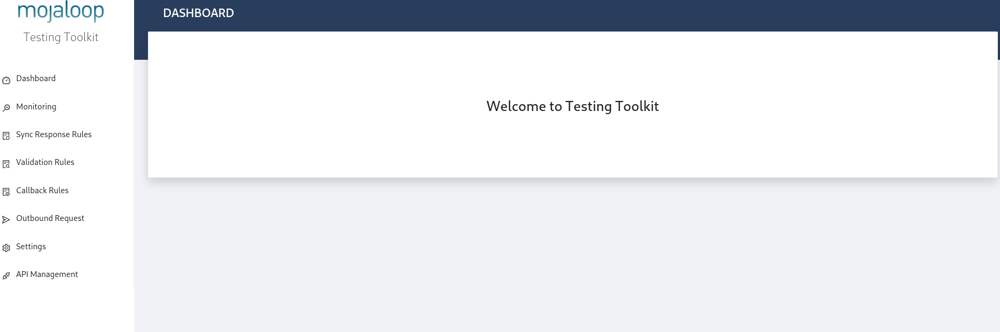

# TTK P2P

You can use the Testing Toolkit to send a Peer to Peer transfer with Mojaloop.

## 1. Opening the Testing Tookit

For this demo, we will pretend to be the `figmm` DFSP.

> Note, we also have a testing tookit deployed for the `eggmm` DFSP: [here](http://eggmm-ttk.beta.moja-lab.live)


Go to the [figmm testing toolkit page](http://figmm-ttk.beta.moja-lab.live)



In the left side bar, select "Outbound Request". This mode lets us import and run sets of Mojaloop API Calls.

## 2. Loading a Sample

Up the top, select "Load Sample" to load a set of sample requests.

Select "DFSP" on the popup window, and select "p2p_happy_path.json". This file contains a simple Lookup, Quote and Transfer set of requests.


Select "OK" to import these requests, and select the "examples" folder on the left popup. 


## 3. Setting up the Environment File

Environments files contain handy defaults for your sample requests. We need to load an environment file and make a few changes for our DFSP.

Again, click into "Load Sample".

This time, open the "Environments" dropdown, and select `examples/environments/dfsp_local_environment.json`


Follow the same steps, and your base environments file will be imported.

On the same page, select "Input Values", this is where we can configure some of the settings for our example.


Do the same with the following input values:

- **`fromFspId`**: `figmm`
- **`toFspId`**: `payeefsp`
- **`payerfsp`**: `figmm`

## 4. Tweaking the Request

Before we send the requests, we need to fix a minor issue in the template.

Back in the "Test Cases" tab, click the "Edit" button:


Underneath "post /quotes" select "Editor":


Scroll to the **"Headers"** section, and click "Add Custom Header"

Input the following:
```
name: FSPIOP-Destination
value: payeefsp
```

## 5. Run The Request

In the top right, click "Send", and view the results!


If everything is configured correctly, you should see all of the tests passing correctly.


> **Handy Tip!**
> If you open up the [monitoring page](http://figmm-ttk.beta.moja-lab.live/admin/monitoring) in a different browser window, you will be able to see all of the requests coming in and out of your DFSP in real time. Pretty neat, isn't it?


