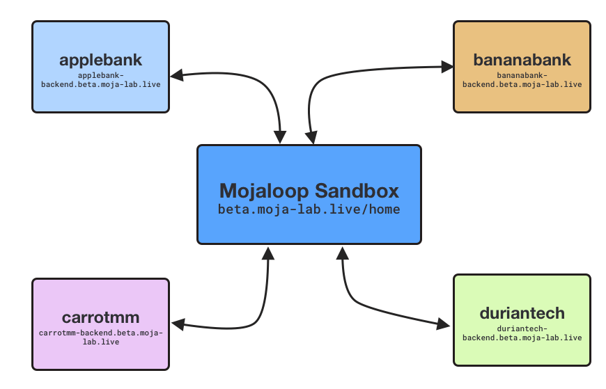

# Overview

This Mojaloop Sandbox is an open environment for playing around with Mojaloop.

All services use the base url `http://beta.moja-lab.live`

## What's included in Environment?

Out of the box, this environment includes the following simulated DFSPs:

**DFSPs**
- `applebank` 
- `bananabank`
- `carrotmm`
- `duriantech`

> **Note**:
> Double check the available DFSPs with this api call:
> `http://beta.moja-lab.live/api/admin/central-ledger/participants`

And the current users are registered and available for lookup in the Account Lookup Service

| dfspId | Id Type | Id Value |
| --- | --- | --- |
| `payeefsp` | `MSISDN` | `27713803912` |

> **Note**: Lewis is in the process of adding to this list 

<!-- ### Users

[todo - MSISDNs etc.]

e.g. 

--> 

You can play around with the existing DFSPs by using the [Simulator UI](http://simulator-ui.beta.moja-lab.live)

## APIs

Mojaloop has a variety of APIs you can interact with:

| Name | Version | Who | Base URL |
| --- | --- | --- | --- |
| [FSPIOP (Mojaloop API)](/2-apis/fspiop)     | `v1.1` | DFSPs             | `beta.moja-lab.live/api/fspiop` |
| [Admin](2-apis/admin)                       | `v1`   | Hub Admins, DFSPs | `beta.moja-lab.live/api/admin/central-ledger` |
| [Settlement](2-apis/settlement.html)        | `v1`   | DFSPs             | (not currently available with this lab) |
| [Thirdparty-DFSP](/2-apis/thirdparty-dfsp)  | `v0.1` | DFSPs             | (not currently available with this lab) |
| [Thirdparty-PISP](/2-apis/thirdparty-pisp)  | `v0.1` | PISPs             | (not currently available with this lab) | 

## Tools:

This sandbox includes the following tools:

- [Sandbox Dev Hub](http://beta.moja-lab.live/home/0-getting-started)
- [Mojaloop Testing Toolkit](todo)
- [Simulator UI](http://simulator-ui.beta.moja-lab.live) - for more information on using the simulator-ui, refer to [todo this external guide]()

<!-- ## Understanding Async APIs -->
<!--  -->
<!-- The Mojaloop APIs follow an asychronous pattern. -->

## Helpful Links

- [Mojaloop Documentation](https://docs.mojaloop.io/documentation/)
- [Mojaloop API Specification v1.0](https://docs.mojaloop.io/mojaloop-specification/documents/API%20Definition%20v1.0.html)
- [Mojaloop API OpenAPI (Swagger)](https://github.com/mojaloop/mojaloop-specification/blob/master/fspiop-api/documents/v1.1-document-set/)

