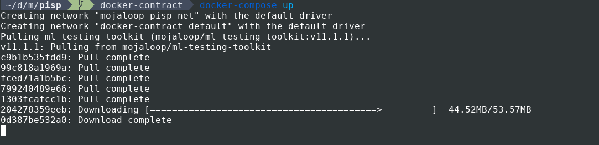
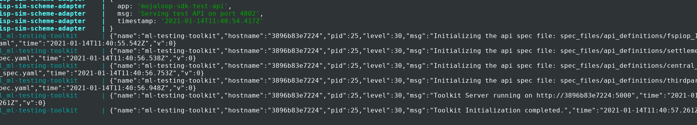
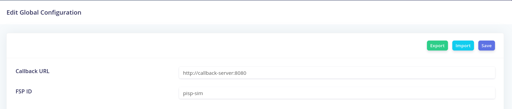
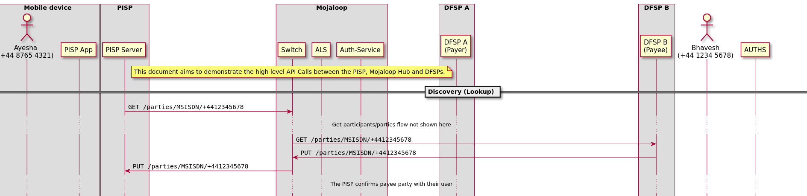
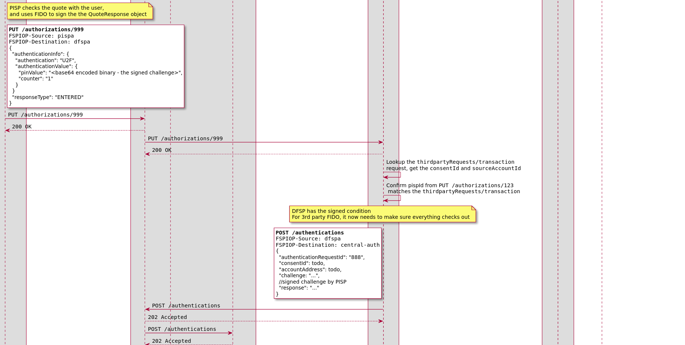

# Trying out the Thirdparty API Locally

The Thirdparty API (PISP API) is still in preview mode, but that doesn't mean you can't use it to build against!

This guide walks you through how to run the testing toolkit locally to support the Thirdparty API.

## Prerequisites

- Command line access on a machine
- A Browser
- `docker` and `docker-compose`, any recent version should work

## 1. Download the TTK Config from the thirdparty-scheme-adapter repo

Go to [https://github.com/mojaloop/thirdparty-scheme-adapter](https://github.com/mojaloop/thirdparty-scheme-adapter). This is where a lot of the in progress work for pisp is taking place.

Clone the repo however you'd like, for example:
```bash
git clone https://github.com/mojaloop/thirdparty-scheme-adapter.git
```

Once that is complete, cd into the `./docker/contract` directory

```bash
cd ./docker/contract
```

## 2. Run `docker-compose up`

In this folder, we maintain a pre-configured testing toolkit that supports the PISP APIs that we run tests against.

Start the containers like so

```bash
docker-compose up
```


And wait for docker to download and run the containers. This may take a little while depending on your connection speed.

You should see some output similar to the following:




## 3. Browse the Locally Running Testing Toolkit

The Testing Toolkit UI will be up and running at [localhost:6060](http://localhost:6060)

Go to the "monitoring" tab to watch the requests as they come in.


## 4. Configure a callback server

We a way to inspect the callbacks from the Testing Toolkit. In your production app, this would be pointed to your application, but for this example we can just log the requests.

We can use docker to run a simple web server which prints out its inbound requests.

Open `docker-compose.yml`, and add a new service on line `8`:

```yaml
...

services:
  callback-server:
    image: mendhak/http-https-echo:15
    networks:
      - mojaloop-pisp-net
    ports:
      - 8081:8080

  ml-testing-toolkit:
    image: mojaloop/ml-testing-toolkit:v11.2.2
  ...

```

Save and close the file, and restart your docker-compose:

`docker-compose up`


You can check the logs for the `callback-server` in a separate window with the following command:
```bash
docker-compose logs -f callback-server 
```


Now we need to confgure the testing toolkit to use the correct callback url.

Go to [`localhost:6060/admin/settings`](http://localhost:6060/admin/settings) and look for the `Callback URL` field.

Change this to `http://callback-server:8080`.

Next, untick the "Enable Callback resource endpoints" box, and hit "Save"



## 5. Call the Thirdparty APIs!

You can now start using the Thirdparty APIs

The API is divided into 2 sections:
- [`Thirdparty-PISP`](http://beta.moja-lab.live/2-apis/thirdparty-pisp.html) for the PISP side of the transaction
- [`Thirdparty-DFSP`](http://beta.moja-lab.live/2-apis/thirdparty-dfsp.html) for an existing DFSP to support PISP's features

To start with, you most likely will want to be using the `Thirdparty-PISP` API.

To understand how a PISP tranfer works, check out the [PISP Transfer documentation here](https://github.com/mojaloop/pisp/blob/master/docs/transfer/README.md) 

### 5.1 Party Lookup:



In this step, the PISP asks Mojaloop to look up the payee party that their user wants to send to.

- Request: `GET /parties/{Type}/{ID}`
- Async Callback: `PUT /parties/{Type}/{ID}`

```bash
curl -X GET http://localhost:15000/parties/MSISDN/12345 \
  -H 'Accept: application/vnd.interoperability.parties+json;version=1.0' \
  -H 'Content-Type: application/vnd.interoperability.parties+json;version=1.0' \
  -H 'Date: Mon, 11 Jan 2021 00:00:00 GMT' \
  -H 'FSPIOP-Source: pispa'
```


Example Logs in `callback-server`:
```
-----------------
{
    "path": "/parties/MSISDN/12345",
    "headers": {
        "content-type": "application/vnd.interoperability.parties+json;version=1.0",
        "date": "Wed, 27 May 2020 11:13:34 GMT",
        "x-forwarded-for": "sed eiusmod sunt",
        "fspiop-source": "pisp",
        "fspiop-destination": "dfspa",
        "fspiop-encryption": "magna Excepteur dolore nisi fugiat",
        "fspiop-signature": "nisi",
        "fspiop-uri": "veniam reprehenderit anim ut",
        "fspiop-http-method": "PUT",
        "content-length": "276",
        "traceparent": "00-ccddd97c01d76f8345331389690b33-0123456789abcdef0-00",
        "user-agent": "axios/0.19.2",
        "host": "callback-server:8080",
        "connection": "close"
    },
    "method": "PUT",
    "body": "{\"party\":{\"partyIdInfo\":{\"partyIdType\":\"MSISDN\",\"partyIdentifier\":\"12345\",\"fspId\":\"pispA\"},\"merchantClassificationCode\":\"4321\",\"name\":\"Justin Trudeau\",\"personalInfo\":{\"complexName\":{\"firstName\":\"Justin\",\"middleName\":\"Pierre\",\"lastName\":\"Trudeau\"},\"dateOfBirth\":\"1980-01-01\"}}}",
    "fresh": false,
    "hostname": "callback-server",
    "ip": "sed eiusmod sunt",
    "ips": [
        "sed eiusmod sunt"
    ],
    "protocol": "http",
    "query": {},
    "subdomains": [],
    "xhr": false,
    "os": {
        "hostname": "18409aa1c315"
    },
    "connection": {}
}
sed eiusmod sunt - - [15/Jan/2021:10:34:20 +0000] "PUT /parties/MSISDN/12345 HTTP/1.1" 200 1280 "-" "axios/0.19.2"

```

### 5.2 `POST /thirdpartyRequests/transactions`

In this step, the PISP asks the DFSP to get a quote that it can 
1. Display to their user
2. Get the user to sign using a private key residing on their device

- Request: `POST /thirdpartyRequests/transactions`
- Async Callback: `POST /authorizations`

```bash
curl -X POST http://localhost:15000/thirdpartyRequests/transactions \
  -H 'Accept: application/vnd.thirdparty.transactions+json;version=1.0' \
  -H 'Content-Type: application/vnd.thirdparty.transactions+json;version=1.0' \
  -H 'Date: Mon, 11 Jan 2021 00:00:00 GMT' \
  -H 'FSPIOP-Source: pispa' \
  -H 'FSPIOP-Destination: dfspa' \
  -d '{
  "sourceAccountId": "mats_account.dfspa.123",
  "consentId": "387ee6b9-520d-4c51-a9e4-6eb2ef15123a",
  "transactionRequestId": "387ee6b9-520d-4c51-a9e4-6eb2ef15887a",
  "payer": {
    "partyIdInfo": {
      "partyIdType": "MSISDN",
      "partyIdentifier": "947947947947",
      "fspId": "applebank"
    },
    "personalInfo": {
      "complexName": {
        "firstName": "Mats",
        "lastName": "Hagman"
      },
      "dateOfBirth": "1983-10-25"
    }
  },
  "payee": {
    "partyIdInfo": {
      "partyIdType": "MSISDN",
      "partyIdentifier": "27713803912",
      "fspId": "payeefsp"
    }
  },
  "amountType": "SEND",
  "amount": {
    "amount": "10",
    "currency": "USD"
  },
  "transactionType": {
    "scenario": "TRANSFER",
    "initiator": "PAYER",
    "initiatorType": "CONSUMER"
  },
  "expiration": "2021-01-30T00:00:00.000"
}'
```

Example Response (in `docker-compose logs -f callback-server`)
```
{
    "path": "/authorizations",
    "headers": {
        "content-type": "application/vnd.interoperability.authorizations+json;version=1.0",
        "accept": "application/vnd.interoperability.authorizations+json;version=1.0",
        "date": "Wed, 27 May 2020 11:13:34 GMT",
        "fspiop-source": "DFSPA",
        "traceparent": "00-ccdd87fbd24d7dfc42d7b58e059dcc-0123456789abcdef0-00",
        "user-agent": "axios/0.19.2",
        "content-length": "775",
        "host": "callback-server:8080",
        "connection": "close"
    },
    "method": "POST",
    "body": "{\"authenticationType\":\"U2F\",\"retriesLeft\":\"1\",\"amount\":{\"currency\":\"USD\",\"amount\":\"124.45\"},\"transactionId\":\"2f169631-ef99-4cb1-96dc-91e8fc08f539\",\"transactionRequestId\":\"387ee6b9-520d-4c51-a9e4-6eb2ef15887a\",\"quote\":{\"transferAmount\":{\"currency\":\"USD\",\"amount\":\"124.45\"},\"payeeReceiveAmount\":{\"currency\":\"USD\",\"amount\":\"123.45\"},\"payeeFspFee\":{\"currency\":\"USD\",\"amount\":\"1\"},\"payeeFspCommission\":{\"currency\":\"USD\",\"amount\":\"0\"},\"expiration\":\"2020-08-24T08:38:08.699-04:00\",\"geoCode\":{\"latitude\":\"+45.4215\",\"longitude\":\"+75.6972\"},\"ilpPacket\":\"AYIBgQAAAAAAAASwNGxldmVsb25lLmRmc3AxLm1lci45T2RTOF81MDdqUUZ\",\"condition\":\"f5sqb7tBTWPd5Y8BDFdMm9BJR_MNI4isf8p8n4D5pHA\",\"extensionList\":{\"extension\":[{\"key\":\"errorDescription\",\"value\":\"This is a more detailed error description\"}]}}}",
    "fresh": false,
    "hostname": "callback-server",
    "ip": "::ffff:172.21.0.2",
    "ips": [],
    "protocol": "http",
    "query": {},
    "subdomains": [],
    "xhr": false,
    "os": {
        "hostname": "18409aa1c315"
    },
    "connection": {}
}
```

Example Body (parsed from the above response):
```json
{
  "authenticationType":"U2F",
  "retriesLeft":"1",
  "amount":{"currency":"USD","amount":"124.45"},"transactionId":"2f169631-ef99-4cb1-96dc-91e8fc08f539","transactionRequestId":"387ee6b9-520d-4c51-a9e4-6eb2ef15887a",
  "quote":{
    "transferAmount":{
      "currency":"USD",
      "amount":"124.45"
    },
    "payeeReceiveAmount":{
      "currency":"USD",
      "amount":"123.45"
    },
    "payeeFspFee":{
      "currency":"USD",
      "amount":"1"
    },
    "payeeFspCommission": {
      "currency":"USD",
      "amount":"0"
    },
    "expiration":"2020-08-24T08:38:08.699-04:00",
    "geoCode":{
      "latitude":"+45.4215",
      "longitude":"+75.6972"
    },
    "ilpPacket":"AYIBgQAAAAAAAASwNGxldmVsb25lLmRmc3AxLm1lci45T2RTOF81MDdqUUZ","condition":"f5sqb7tBTWPd5Y8BDFdMm9BJR_MNI4isf8p8n4D5pHA",
    "extensionList":{
      "extension":[null]
    }
  }
}
```

You can see that the DFSP has issues the `POST /authorizations` to the PISP containing a Quote they can display to their end user.


### 5.3 `PUT/authorizations/{ID}`
 -->

**WARNING - this section is under develompent, and is being fixed as you read this**

```bash
curl -X PUT http://localhost:15000/authorizations/999 \
  -H 'Accept: application/vnd.interoperability.thirdparty+json;version=1.0' \
  -H 'Content-Type: application/vnd.interoperability.thirdparty+json;version=1.0' \
  -H 'Date: Mon, 11 Jan 2021 00:00:00 GMT' \
  -H 'FSPIOP-Source: pispa' \
  -H 'FSPIOP-Destination: dfspa' \
  -d '{
        "authenticationInfo": {
          "authentication": "U2F",
          "authenticationValue":{
            "pinValue": "aaabbbcccddd",
            "counter": 1,
          }
        },
        "responseType": "ENTERED"
      }'
